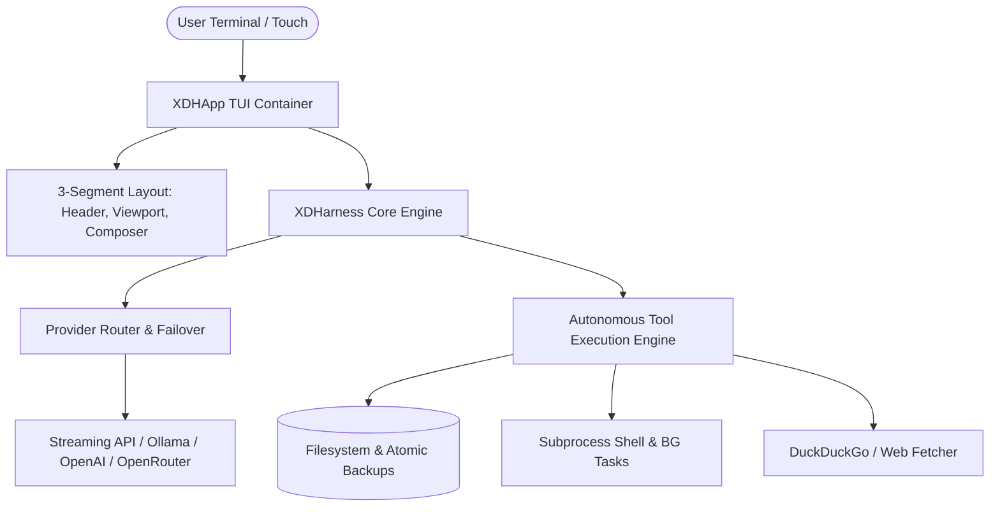

<div align="center">

# ⚡ xdh (xdharness)

**Autonomous Terminal Agent Harness & TUI**  
*Cross-platform intelligence for Android Termux, Linux, macOS, and Windows*

[](https://github.com/PwnedBytes0x1/xdh/releases)
[](LICENSE)
[](https://python.org)
[](https://github.com/PwnedBytes0x1/xdh)

[Features](#-features) • [Installation](#-installation) • [Quick Start](#-quick-start) • [Slash Commands](#-slash-commands) • [Documentation & Wiki](#-documentation--wiki) • [Architecture](#-architecture) • [Contributing](#-contributing)

---

</div>

## 🌟 Highlights

`xdh` is a lightweight, high-performance terminal agent harness and Text User Interface (TUI) built for autonomous code generation, system exploration, and agentic workflows. Designed with first-class support for **Android Termux** as well as standard desktop operating systems.

```text
  ██╗  ██╗██████╗ ██╗  ██╗
  ╚██╗██╔╝██╔══██╗██║  ██║
   ╚███╔╝ ██║  ██║███████║
   ██╔██╗ ██║  ██║██╔══██║
  ██╔╝ ██╗██████╔╝██║  ██║   xdharness v1.0.0
```

---

## 🚀 Features

- 🖥️ **3-Segment Layout**: Real-time context header (tokens, RAM, latency, provider/model), scrollable history viewport with collapsible blocks, and dynamic multi-line composer.
- 🔄 **Multi-Provider Failover**: Native streaming integration with OpenAI, OpenRouter, Anthropic, DeepSeek, Groq, Ollama, LM Studio, and more. Automatically fails over to backup providers on rate limits (429) or server errors (5xx).
- 🛠️ **Autonomous Agent Tools**:
  - `bash_run`: Sandboxed execution with timeout and output capture.
  - `read_file` & `write_file`: Atomic file read/write with automatic backup generation.
  - `edit_file`: Smart fuzzy matching and targeted block replacement.
  - `diff_files` & `/apply`: Unified diff generator and staged hunk applicator.
  - `web_search` & `web_fetch`: DuckDuckGo query integration and readable text extraction.
  - `bg_task`: Background task runner with detached output streams.
  - `tree_view`: Directory visualizer with gitignore-awareness.
- 🎨 **7 Curated Color Palettes**: `tokyo_night`, `dracula`, `catppuccin`, `monokai`, `nord`, `cyberpunk`, and `gruvbox`.
- 📱 **Mobile & Termux First**: Smooth step-scroll animation for touch gestures, compact mini-banners for narrow viewports (<70 cols), and zero heavy C-extension dependencies.
- 🧠 **Context Optimization**: Automatic message history compaction when nearing token capacity thresholds.

---

## 📦 Installation

### From Source (Git)

```bash
git clone https://github.com/PwnedBytes0x1/xdh.git
cd xdh
pip install -r requirements.txt
pip install -e .
```

### Direct Execution

```bash
python3 -m xdh --version
```

### Termux Quick Setup

```bash
pkg update && pkg install python git -y
git clone https://github.com/PwnedBytes0x1/xdh.git
cd xdh
pip install -r requirements.txt
ln -s $(pwd)/xdh.py $PREFIX/bin/xdh
chmod +x $PREFIX/bin/xdh
xdh
```

---

## ⚡ Quick Start

1. **Launch `xdh`**:
   ```bash
   xdh
   ```

2. **Configure Your Provider & Key**:
   Type `/settings` inside the interface or edit `~/.xdharness/config.json`. You can switch providers dynamically:
   ```text
   xdh ❯ /provider openrouter
   xdh ❯ /model anthropic/claude-3.5-sonnet
   ```

3. **Interact**:
   Type plain language prompts to instruct the agent to inspect files, execute tests, refactor code, or run background builds.

---

## ⌨️ Slash Commands

| Command | Description | Example |
| :--- | :--- | :--- |
| `/settings` | Open interactive settings & quick toggles | `/settings theme dracula` |
| `/provider` | Switch active provider | `/provider openai` |
| `/model` | Switch model for active provider | `/model gpt-4o` |
| `/theme` | Switch color theme palette | `/theme catppuccin` |
| `/tools` | Enable or disable agent function tools | `/tools on` or `/tools off` |
| `/thinking` | Toggle live thought/reasoning token streaming | `/thinking on` |
| `/diff` | Inspect staged file diffs proposed by agent | `/diff` |
| `/apply` | Apply pending unified diffs to files | `/apply` |
| `/tasks` | List, inspect, or kill background tasks | `/tasks list` / `/tasks logs <id>` |
| `/git` | Execute git status, diff, or commit directly | `/git status` |
| `/scratch` | Access or update persistent scratchpad memo | `/scratch set <notes>` |
| `/tree` | Print directory tree of current workspace | `/tree` |
| `/index` | Build or query workspace keyword index | `/index build` |
| `/copy` | Copy last response or code block to clipboard | `/copy` |
| `/undo` | Roll back latest file edit from backups | `/undo` |
| `/clear` | Clear viewport history (or `Ctrl+L`) | `/clear` |
| `/help` | Show command reference table | `/help` |
| `/exit` | Save session state and exit (or `Ctrl+Q`) | `/exit` |

---

## ⌨️ Keybindings

- **`Tab`**: Auto-complete slash command / accept ghost suggestion.
- **`Right Arrow`**: Accept ghost suggestion at line end.
- **`Up / Down`**: Navigate history or smooth-scroll conversation viewport.
- **`Ctrl+T`**: Cycle color themes dynamically.
- **`Ctrl+P`**: Cycle configured AI providers.
- **`Ctrl+O`**: Toggle block collapse (compact vs expanded summary).
- **`Ctrl+L`**: Clear current viewport.
- **`Ctrl+C`**: Interrupt running generation / exit.
- **`Ctrl+Q`**: Save session and quit.

---

## 📚 Documentation & Wiki

Detailed guides and specifications are organized in [`docs/wiki/`](docs/wiki/):

- 🏠 **[Home & Overview](docs/wiki/Home.md)**: Product overview and architecture.
- 🚀 **[Getting Started & Installation](docs/wiki/Getting-Started.md)**: Step-by-step setup across Termux, Linux, macOS, and Windows.
- ⚙️ **[Configuration & Providers](docs/wiki/Configuration.md)**: API keys, model parameters, custom endpoints, and auto-failover.
- 🛠️ **[Tools & Workflows](docs/wiki/Tools-and-Capabilities.md)**: Deep dive into diff generation, sandbox execution, web search, and tasks.
- 🎨 **[Theming & UI Customization](docs/wiki/Theming.md)**: Theme reference and customizing styles.
- 🔌 **[Extensibility & Architecture](docs/wiki/Architecture.md)**: Harness internals, compaction, streaming protocols, and lifecycle.

---

## 🏗️ Architecture



---

## 🤝 Contributing & Community

Contributions are welcome! Please review our community guidelines before getting started:
- 📜 **[Code of Conduct](CODE_OF_CONDUCT.md)**
- 💡 **[Contributing Guide](CONTRIBUTING.md)**
- 🔒 **[Security Policy](SECURITY.md)**

---

## 📄 License

This project is licensed under the **MIT License**. See the [LICENSE](LICENSE) file for details.
